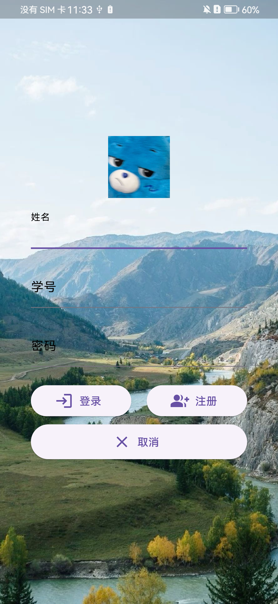
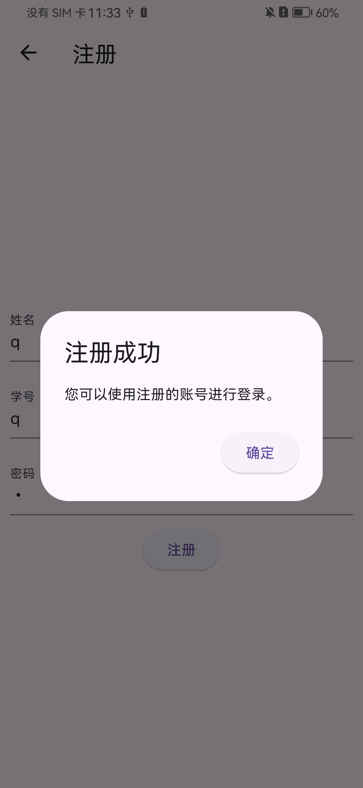

#flutter_homework - 电商平台
这是一个flutter仿拼多多电商平台的作业项目，用户可以浏览滑动商品列表，点击商品卡片后即可查看对应商品的详情界面，点击图片后可查看商品详细信息

##实现功能：
·用户的注册与登录，用户需要注册后才可进入登录界面
·在登录界面添加了取消按钮，点击后即可清除输入框内容
·在商品浏览界面添加了底部导航栏并在组件添加了双十一的Icon，增加购物节氛围
·在商品浏览界面顶部添加了搜索框，搜索框做了返回值处理，后续可添加搜索功能根据用户输入的内容进行搜索,并添加了相机图标按钮，方便后续调用相机界面
·在商品浏览界面顶部添加了顶部导航栏，用户点击任意Tab后，即可跳转对应页面并且文字变为红色
·商品浏览界面可滑动并添加了缓存功能，记忆用户当前浏览的位置，当用户返回当前界面时,可返回上次浏览到的位置
·使用了多图轮播插件和手势检测器，当点击商品图片后，可通过滑动查看多张商品照片并实现双击照片进行放大缩小，并且添加了底部显示：当前商品页数/总页数
·在个人界面添加了多个功能按钮，并在底部加入了"退出登录"按钮返回登录界面，点击左上角侧边栏按钮即可拉出侧边栏，显示更多信息

##截图：

